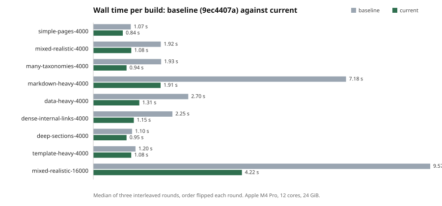
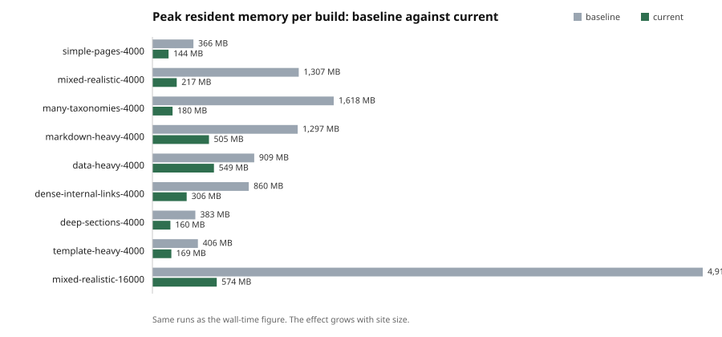
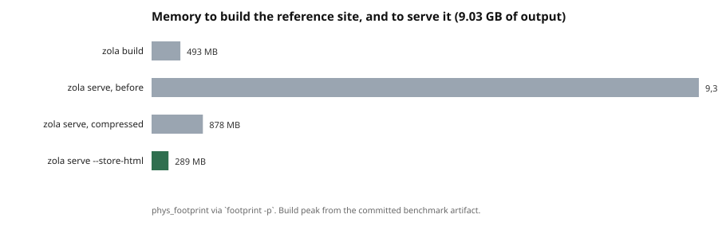

# Faster Without Computing Less

**A measurement-driven performance study of a static-site generator at 4,000–16,000 pages**

> Zola at Scale, ZPERF-001. Status: **published**, 2026-08-13.
>
> This work was done in a fork of [Zola](https://github.com/getzola/zola). It is
> not affiliated with, endorsed by, or speaking for the upstream project. Where a
> behaviour is upstream's rather than this fork's, the paper says so and names
> the commit it was reproduced on.

## Abstract

Zola is a static-site generator with a reputation for speed, which makes it an
interesting subject: there is no obvious algorithmic disaster to find. We
instrumented it, profiled it, and measured a matrix of synthetic workloads from
100 to 16,000 pages plus one real 3776-page site producing 9.03 GB of HTML,
then optimized only what the measurements identified. Against the same binary
plus instrumentation, in a single interleaved session, wall time fell by 14% to
74% depending on workload and peak memory by 40% to 89%; the real site improved
35.1% in CPU and 33.3% in wall time — though a second session reproduced the CPU
figure to within half a point and did not reproduce the wall figure at all, which
is itself one of the results. Total CPU barely moved on most synthetic
workloads while wall time halved, which is the paper's central finding: the
program did not compute less, it stopped waiting and stopped allocating. Four
attractive optimizations were rejected on measurement, three of them for the
same reason. The largest single win came from replacing the platform allocator,
not from any change to Zola's own logic. Finally, the study's own scope turned
out to be wrong: it had measured `zola build` throughout and never `zola serve`,
which held 9371 MB for the site that builds in 493 MB, and which had a rebuild
path that reported success while serving stale bytes. That asymmetry, not the
build numbers, is what motivates the next architecture.

## Context

Zola builds a static site from Markdown and Tera templates and ships as one
binary. It is fast on the sites most people have. This study is about what
happens further out, where a site has thousands of pages and a build stops
feeling instant.

The work happened in a fork carrying a long-running performance program. Its
evidence lives in `docs/performance/`: a hotspot inventory with numbered
`PERF-*` items, an append-only optimization log that includes the failures, and
raw benchmark artifacts under `benchmarks/results/`. This paper is a narrative
over that evidence; it introduces no measurements of its own.

Two workloads matter throughout:

* **Synthetic fixtures** — eight scenarios generated deterministically from a
  seed (`scripts/perf/gen_site.py`), each isolating one cost: page count,
  taxonomies, internal links, section depth, template work, Markdown and code
  highlighting, per-page data loading, and a mixed profile calibrated against
  the real site. Sizes from 100 to 16,000 pages.
* **A real site** — 3776 pages and 1640 sections, producing 6592 output files
  and 9.03 GB of HTML. Its content is not redistributable; its shape is
  documented, and the mixed synthetic scenario exists to approximate it.

That second workload earns its place by being unreasonable. Its pages average
1.6 MB because 88% of every page is the same navigation tree. Nothing in the
synthetic matrix behaves like that, and several of this study's findings only
appear on it.

## Problem

The motivating complaint was ordinary: a site of a few thousand pages had become
uncomfortable to rebuild. The tempting response is to guess — quadratic lookup
somewhere, a bad data structure, too much cloning — and start reading code.

Guessing is cheap and usually wrong, and it is expensive to be wrong slowly. So
the program's first rule was that nothing gets optimized before it is measured,
and its second was that no result counts unless the output is byte-identical to
what the previous binary produced.

The first rule is the one people agree with and skip. The second is the one that
makes the first survive contact with a deadline.

## Methodology

### Instrumentation before optimization

A `--timings` flag was added to `zola build`, printing a hierarchical breakdown
of every phase plus per-item costs inside the parallel ones. Disabled, it costs
one relaxed atomic load per instrumentation point. Everything downstream —
knowing that the render cache was 24% of a build, that discovery was 13–27% on a
section-dense tree — came from that flag rather than from intuition.

Phase timings answer *where*; they do not answer *why*. For that: `samply` CPU
profiles summarised by `scripts/perf/analyze_profile.py`, and a counting global
allocator behind a feature flag reporting allocations and bytes per phase.

### Comparing two binaries

Early in the program a sequential comparison — all runs of A, then all runs of B
— produced a −69% result that was entirely thermal drift. That mistake set the
rule: **every comparison is interleaved**. `scripts/perf/ab.py` alternates the
two binaries inside each round, flips their order between rounds, and reports:

* the **paired per-round delta**, not the difference of two medians;
* whether **every round agrees on the sign**;
* **CPU time alongside wall time**.

The last two matter more than they sound. A build that writes gigabytes stalls
on the filesystem in ways that move wall time by seconds in both directions
while CPU stays flat. And judging on medians of absolute numbers threw away a
real, unanimous 23.7% CPU result on the reference site, because filesystem
stalls made the absolute numbers noisier than the effect. Pairing is what
recovers it.

When a change is worth less than the noise floor of a whole-build comparison,
the honest move is to measure the phase or the profiler symbol instead, and to
say which was measured. An unresolved effect is reported as unresolved.

### Correctness

Every accepted change had to produce byte-identical output.
`scripts/perf/compare_output.py` builds a site with both binaries and compares
the trees file by file. One change was deliberately exempt, because it was
*about* output: before it, two runs of the same binary produced different bytes
for any page with more than one taxonomy, since `page.taxonomies` and Tera's
maps were hash-ordered. Fixing that was a prerequisite for the equivalence gate
to mean anything.

### Machine

Apple M4 Pro, 12 cores, 24 GiB, macOS 26.2. Release builds with a pinned profile
(`scripts/perf/build.sh`), because a developer's global `~/.cargo/config.toml`
can silently change `lto`, `panic` and `target-cpu` for every build on the
machine. Where a run competed with unrelated load, the paper says so.

## Baseline

The starting point was upstream 0.23.3 with only the instrumentation added
(commit `9ec4407a`). What it showed:

| Finding | Evidence |
| ------- | -------- |
| Nothing is superlinear. Every scenario is linear in page count from 2k up. | `SCALING.md` |
| Small sites are dominated by fixed startup: a 100-page build cost **128 ms / 174 MB**. | `BASELINE.md` |
| Syntax highlighting did not parallelise at all: the Markdown phase took *longer* on twelve threads than on one. | CPU profile |
| The render cache was 24% of a 4000-page build and most of its heap. | `--timings`, allocation profile |
| A data-driven site spent 61–72% of busy CPU blocked on one mutex in `load_data`. | CPU profile |

That last pair is the useful shape of a baseline: the problems were not in the
algorithms, they were in *contention* and in *copying*.

## Investigation

Rather than narrate eleven backlog items, here are the four whose findings
generalise.

### The render cache was materialising the site once per container

`RenderCache` pre-serializes pages, sections and taxonomies into `tera::Value`
once, so that rendering N pages does not re-serialize the library N times. The
intent is sound. The implementation serialized a section *with its pages inside
it* — and `Value::from_serializable` walks a structure through serde and rebuilds
every value it finds, including values already built. Each page was therefore
materialised again inside its section, and again inside every taxonomy term it
belonged to.

That was 86% of peak heap. The fix serializes the container with an empty
placeholder and splices the existing `Arc`-backed values into it, which is a
refcount bump instead of a deep copy.

### Highlighting was serialised on one mutex, in a dependency

The syntax-highlighting crate held a single `Mutex<RegSet>` shared by every
worker thread, because the underlying regex-set search mutates internal region
storage. Twelve threads therefore queued behind one lock: the Markdown phase
measured 1.58 s on one thread and 1.69 s on twelve.

The fix — a compiled regset per thread, in the dependency rather than in Zola —
is carried here as a patched vendored copy until it is released upstream. The
alternative that needed no vendoring, a per-thread registry clone inside Zola,
was just as fast and cost about 310 MB more, because it duplicates every grammar
instead of only the regsets a thread actually compiles.

### A quarter of the CPU was in `malloc`

This one is the reason the study is worth reading. A CPU profile of the
reference site attributed **34 s of 138 s** of busy CPU to the platform
allocator itself — `_xzm_free`, `xzm_malloc`, `_xzm_xzone_malloc` and friends,
which is macOS's xzone allocator. No Zola function was implicated. The workload
is simply that allocator's worst case: twelve rayon workers each build a
multi-megabyte page string, hand it to the minifier, which allocates another,
and drop both.

Replacing the global allocator with mimalloc took **−23.7%** of build CPU on
that site, unanimous across five interleaved rounds, with peak memory down
**−9.9%** and byte-identical output. On the small-page synthetic fixtures it did
nothing at all — `−1.2%` on the 4000-page mixed scenario, with the rounds
disagreeing on the sign. It is a large-page win, not a general one, and it is
documented that way.

### The same file, hashed once per page

`get_url(cachebust=true)` and `get_hash(path=…)` open, read and SHA their target
on every call. Both are template functions, so a cachebusted stylesheet link in
a base template hashes the same file once per page: on the reference site, three
files — one of them a multi-megabyte generated search index — hashed across all
5601 outputs.

This is where the noise-floor rule earned its keep. The whole-build A/B was
`−0.4%` with the rounds disagreeing: a non-result. The profiler is unambiguous:
`compute_hash` accounted for **2217 ms** of self time before the change and does
not appear in the top 40 afterwards. The change was taken because it is also
simply correct — the previous code re-read a file up to 5601 times per build —
and the paper reports the A/B as unresolved rather than quoting a number the
data does not support.

The memo is keyed by path and validated against the file's timestamp and length,
not trusted for the build's duration. The lookup helper also searches the
*output* directory, so a hashed file can be one the build itself writes; a
path-only cache would be a correctness bug waiting for someone to hash a
generated file.

## Results

Baseline `9ec4407a` against the current tree, one interleaved session, three
rounds per site, order flipped each round. **Every wall figure below is
unanimous across rounds** — within a session. The one workload measured in two
sessions had its wall figure fail to reproduce across them; see below.

| Workload | Wall | Peak RSS | CPU |
| -------- | ---- | -------- | --- |
| `markdown-heavy-4000` | 7.18 s → 1.91 s (**−74%**) | 1297 → 505 MB (−61%) | −42.4% |
| `mixed-realistic-16000` | 9.57 s → 4.22 s (−56%) | 4913 MB → 574 MB (**−88%**) | −4.1% ‡ |
| `data-heavy-4000` | 2.70 s → 1.31 s (−52%) | 909 → 550 MB (−40%) | −8.2% |
| `many-taxonomies-4000` | 1.93 s → 0.94 s (−51%) | 1618 → 180 MB (−89%) | −19.4% |
| `mixed-realistic-4000` | 1.92 s → 1.08 s (−46%) | 1307 → 217 MB (−83%) | −8.0% |
| `dense-internal-links-4000` | 2.25 s → 1.15 s (−43%) | 860 → 306 MB (−64%) | −15.1% |
| `template-heavy-4000` | 1.20 s → 1.08 s (−23%) | 406 → 169 MB (−58%) | −9.9% ‡ |
| `simple-pages-4000` | 1.07 s → 0.84 s (−22%) | 366 → 144 MB (−60%) | −7.6% |
| `deep-sections-4000` | 1.10 s → 0.95 s (**−14%**) | 383 → 160 MB (−58%) | +0.1% ‡ |
| the real site, 9.03 GB out | 44.3 s → 32.2 s (−33.3%) † | 676 → 504 MB (−25.5%) | **−35.1%** |

‡ the CPU rounds disagreed on the sign; treat those three as unresolved.
† this wall figure **did not reproduce** in a second session, which measured
−26.1%. The CPU figure on the same row reproduced to within half a point. Both
sessions are below.





The reference-site row was measured while the machine carried unrelated load, so
its absolute seconds are inflated — the same binary builds that site in 30.2 s
on a quiet machine. The paired delta is unaffected, which is the point of
pairing; the absolutes are quoted only to show what was compared.

Fixed startup fell too, which matters disproportionately for small sites: a
100-page build went from **128 ms / 174 MB** to **52 ms / 76 MB**.

### The reference-site comparison, run twice

The reference-site row was measured a second time, in a later session, with the
same two binaries and the same procedure. Both runs were unanimous across their
rounds. Set side by side they say something the individual numbers cannot:

| | first session | second session | apart by |
| --- | ------------- | -------------- | -------- |
| CPU | −35.1% | **−35.6%** | 0.5 points |
| peak RSS | −25.5% | **−22.0%** | 3.5 points |
| wall | −33.3% | **−26.1%** | 7.2 points |

**The CPU figure reproduced to within half a point; the wall figure did not
reproduce at all.** Two sessions agreeing is consistent with replication and does
not establish it — same machine, same OS, same binaries, same harness, same day —
so the absolute claim here is "reproduced once, under similar conditions", not
"replicates". The *comparative* claim needs no such hedge and does not depend on
having two sessions: in the second session the baseline side's wall times spread across
**35.1 s** — one round took 70 s while spending a perfectly ordinary 280 s of
CPU — and two consecutive runs of the *same* binary produced 31.8 s and 36.8 s.
Each of those three observations is on its own sufficient to show that wall time
here measures the machine's mood, and none of them needs a second session.

This is the paper's methodology arguing with its own headline figure, and the
figure loses. Wall time on a shared desktop measures the desktop. Where this
paper quotes a wall number it is because that is what a user experiences, but
where wall and CPU disagree, CPU is the one that describes the change.

### What the CPU column means

Wall time halves on most rows while total CPU barely moves. That is the finding.

**This work did not make Zola execute fewer instructions. It made Zola stop
waiting and stop allocating.** The wins came from a mutex that serialised twelve
threads onto one, a phase that materialised a copy of every page for every
container it belonged to, a lock held across file I/O, and an allocator that
could not keep up with megabyte-sized strings. Only `markdown-heavy` (−42.4%)
and the reference site (−35.1%) show a large CPU drop, and those are exactly the
two workloads where contention and allocation *were* the computation.

The corollary is a ceiling. On twelve cores there is not much parallelism left
to unlock; further gains have to come from doing less work. The profile says the
remaining work is real: Tera interpreting templates (28% of busy CPU) and
minify-html parsing what those templates produced (23%). Both are third-party,
both are doing something the site asked for.

## Negative results

Four optimizations were tried and rejected. They are the most reusable part of
the study, because they are the ideas a reader is most likely to have.

### Caching created directories — no gain

`create_dir_all` runs per output file and showed as 18.9% of busy CPU on a
1000-page site. Two variants were implemented: a shared set of known
directories, and a thread-local one. Neither moved wall time measurably. The
syscall is cheap when the directory already exists, and the profile attribution
was measuring the cost of *being on that path*, not of the call.

### Parallel output cleaning, and rename-aside — no gain

Deleting the previous output was 663 ms, 36% of wall on the reference workload.
Parallel deletion was not faster. Renaming the tree aside and deleting it in a
background thread removed the phase from the timeline entirely — 930 ms → 0.2 ms
— and **did not change wall time at all**, because the build then simply
competed with the background deletion for the same disk.

### Parallelising the static copy — measurably worse

The most instructive failure. Copying `static/` is a serial loop; on the
reference site it is 989 files in 170–190 ms. Parallelising it with rayon did
nothing there — 55 MB in 190 ms is ~290 MB/s, which is the disk, not the loop —
so the experiment was repeated on the case parallelism should win: 5000 files of
1 KB, where per-file syscall latency dominates.

It was **10–30% slower**, in every round:
**640/814/842 ms serial against 838/899/1023 ms parallel**.
Twelve threads creating files in a handful of
directories contend on directory metadata, and each copy also probes for its
parent, so they hammer the same paths simultaneously.

Three filesystem experiments, three failures with the same shape. That is no
longer an anecdote:

> On this platform, filesystem metadata operations do not parallelise. They
> anti-parallelise. Bulk throughput is the disk's business, and the loop around
> it is not what costs.

A fourth, smaller rejection: eliminating a `stat` per `load_data` cache-key
computation. Re-profiling after the lock fix showed that *every* `stat` in the
entire build is 439 ms of self time, so this one was worth a few milliseconds —
and the timestamp it reads is exactly what stops the cache serving a data file
that changed.

## Correctness validation

Every accepted change was verified byte-for-byte with
`scripts/perf/compare_output.py` on at least one synthetic scenario and, for the
allocator and hashing changes, on the full 6592-file reference site. The quality
gate — `cargo fmt --check`, a clippy ratchet, and `cargo test --workspace` — ran
for every commit.

Two changes are deliberate behaviour differences and are recorded as such in the
fork's `CHANGELOG.md`: builds are now reproducible (maps that reach templates
iterate in a stable order, and `page.taxonomies` is sorted by name), and
`zola build --timings` exists. The determinism change alters output for
templates that iterate a map, by reordering it and never by changing its
contents. There is a test that fails if map ordering becomes unstable again.

## The scope was wrong

Everything above concerns `zola build`. The program ran for its entire length
without once measuring `zola serve`, which is the command a person actually sits
in front of.

Two things were found within a day of looking.

### `serve --fast` applied nothing

`zola serve --fast` is documented to rebuild only what changed. Editing a page
under it produced: change detected, file re-parsed, render job run, `Done in
0ms` printed — and the server continued returning the page as it had been
*before* the edit. Not a stale listing elsewhere on the site: the edited page
itself.

The cause is one line of architecture. Rendering reads page and section values
out of `RenderCache`, and the fast path never refreshed it, so the template was
handed the copy serialized before the edit. This is **upstream behaviour, not
this fork's**: the baseline binary `9ec4407a` behaves identically. Refreshing
the cache before rendering fixes it, and a content edit on a 4000-page site then
costs 34–41 ms against 447–481 ms for the full rebuild `serve` does without
`--fast`.

A neighbouring bug surfaced in the same area: `zola serve --output-dir <dir>`
failed every rebuild after the first with *"Directory already exists. Use
--force to overwrite"*, printed `Done in 23ms`, and served the previous build.
The startup guard against clobbering a directory was being re-asked on every
rebuild — against a directory the server itself had just filled. Also
pre-existing upstream.

Both bugs share a signature worth naming: **a rebuild that reports success while
doing nothing**. A performance program that only ever times full builds will
never see either.

### Serving the site cost 9.4 GB

`zola serve` keeps rendered HTML in a process-global map instead of writing it to
disk. For the reference site that is:

| | memory |
| --- | ------ |
| `zola build` | **493 MB** |
| `zola serve` | **9371 / 9368 / 9405 MB** |

Nineteen times the build, and it is simply the output — 6592 files, 9.03 GB of
HTML — held in a map for the life of the process. On a 24 GiB machine that site
takes 39% of RAM to serve; twice its size could not be served at all, while
still building in well under a gigabyte.



This was nearly missed through a measurement error worth publishing. `ps -o rss`
reported **8–20 MB** for that process while it was returning 2.6 MB pages. RSS
is the wrong metric: macOS compresses an idle process's pages out of resident
memory and faults them back on touch. `footprint -p` reports the physical
footprint, and the physical footprint was 9.2 GB. The first reaction was to file
the discrepancy as a curiosity and move on; it turned out to be the largest
memory number the program had produced.

Two fixes landed, both measured on the same site:

* **Compress the map.** Pages of a template-driven site are mostly the same
  bytes *as themselves* — that 88% navigation tree — so zstd at level 1 gets
  **29×** on this data, measured per output because that is how the map stores
  them. Footprint went from 9371 / 9368 / 9405 MB to **882 / 870 / 878 MB**,
  unanimous across three rounds, with byte-identical responses, no new flag, and
  no new dependency (zstd was already in the tree). The cost is startup: eight
  interleaved rounds gave a median **+13%**, six rounds slower and two faster,
  which is unresolved in sign and consistent with the arithmetic of compressing
  9 GB at that level across eleven usable cores — about two seconds.
* **Let `--store-html` serve from disk.** That flag used to write every page to
  disk *and* keep it in memory, although the request handler has always fallen
  back to the output directory on a miss. It now writes only: **289 MB**, at the
  cost of a slower full rebuild and requests that read the filesystem.

Neither is the right answer. `serve` already holds everything needed to render a
page on demand; the map exists to make requests fast, and a preview server does
not obviously need a page pre-rendered before anyone asks for it. That change is
not built.

## Limitations

* **One machine, one OS.** Every number is from an Apple M4 Pro on macOS. The
  allocator result in particular blames macOS-specific symbols; against glibc it
  may be smaller or absent. Nothing here has been measured on Linux or Windows.
* **One real workload.** The reference site is unusual — 1.6 MB pages, 88%
  duplicated navigation. Several findings only appear on it, which is the point
  of including it, but it is not representative of "a Zola site".
* **A loaded machine.** Several runs competed with unrelated work. Pairing makes
  the deltas trustworthy; the absolute seconds in those rows are not. The
  reference site is the only workload measured twice, and only its CPU delta
  replicated closely; treat every single-session wall figure in the table above
  as having the same 7-point uncertainty the repeat exposed.
* **Not every figure has a committed artifact.** The profiler results and the
  process footprints were read from terminals; the numbers are transcribed in
  `docs/performance/` and in this paper's evidence manifest with the method that
  produced them, but a reader cannot re-extract them from a file. The A/B and
  benchmark results can be.
* **The `serve` work is partial.** Compression and disk-backed serving both
  landed and are measured. Render-on-demand is a design, not an implementation.

## What surprised us

1. **The largest single win was not in Zola.** A quarter of the build's CPU was
   inside the system allocator. No amount of reading Zola's source would have
   found it; only a profile did.
2. **Wall time and CPU time told different stories,** and the difference was the
   most informative number in the study.
3. **Three separate attempts to parallelise filesystem work all made things
   slower.** Each looked obviously correct beforehand.
4. **The most expensive mistake was a scope decision, not a code decision.**
   Benchmarking only the batch path hid both a correctness bug and an order-of-
   magnitude memory problem in the path developers actually use.
5. **`ps -o rss` can be wrong by a factor of 400** on an idle macOS process, and
   a plausible-looking small number is more dangerous than an implausible one.

## Architectural implications

The build is now dominated by producing output: on the reference workload, 94%
of it is rendering and writing, and no scheduling change makes a page that *did*
change cheaper to produce. Further build-side gains have to come from producing
less — which means not producing what did not change.

That is a statement about incrementality, and the `serve` findings say the same
thing from the other side. `serve` is a long-running process that rebuilds
constantly and holds its entire output; its cost structure is not the batch
build's. Optimizing the batch build to a floor, and then discovering that the
interactive path has a different floor entirely, is the natural point to stop
optimizing and start redesigning.

## Future work

Explicitly **not implemented**, and carrying no measurements:

* **Correct partial rebuilds.** `--fast` re-renders the changed page and nothing
  that embeds it: listings, taxonomy terms, feeds and the sitemap stay stale
  until a full rebuild. The invalidation rules are enumerated in this fork's
  `INCREMENTAL-BUILD-DESIGN.md`; the interesting part is the correctness gate,
  since an incremental rebuild that disagrees with a clean build is a bug
  generator.
* **Render-on-demand serving,** which would take the in-memory map to nothing.
* **Content-addressed intermediate artifacts with a dependency DAG** — a
  reverse-dependency index, precise transitive invalidation, and a persistent
  reusable cache, with a clean build as the correctness oracle. Potentially
  evolving into a Merkle DAG in which a node's identity derives from its local
  semantic inputs, its dependencies' hashes, the configuration that reaches it,
  and a build-semantics version, so that an unchanged subtree is provably
  reusable across runs.

  **This is a design hypothesis.** There is no implementation, no prototype and
  no measurement. It is motivated by two things this study did measure — that a
  rebuild's cost is dominated by regenerating output that mostly did not change,
  and that the long-running path has a different cost structure from the batch
  one — but motivation is not evidence, and no performance prediction should be
  attached to it until something exists to measure.

## Reproduction

The synthetic half of this paper reproduces from a clean checkout. The reference
site does not: its content is not redistributable. Its shape — 3776 pages, 1640
sections, 6592 outputs, 9.03 GB, ~1.6 MB per page — is what
`mixed-realistic-16000` approximates, and every synthetic figure here can be
re-derived.

```bash
# 1. the baseline binary: upstream 0.23.3 plus instrumentation only
git worktree add /tmp/zola-baseline 9ec4407a
cd /tmp/zola-baseline && scripts/perf/build.sh && cp target/release/zola /tmp/zola-BASE

# 2. the current binary, same pinned profile
scripts/perf/build.sh && cp target/release/zola /tmp/zola-HEAD

# 3. generate the fixtures (deterministic from a seed)
python3 scripts/perf/gen_site.py --scenario mixed-realistic --pages 4000

# 4. the comparison in this paper's results table
scripts/perf/run.sh ab /tmp/zola-BASE /tmp/zola-HEAD \
    benchmarks/sites/mixed-realistic-4000 \
    benchmarks/sites/markdown-heavy-4000

# 5. the correctness gate every change had to pass
scripts/perf/run.sh equivalence /tmp/zola-BASE /tmp/zola-HEAD

# 6. where a single build's time goes
cd benchmarks/sites/mixed-realistic-4000 && zola build --force --timings -o /tmp/out

# 7. the repository's own health gate
scripts/dev.sh quality
```

The `serve` memory figures are read with macOS's `footprint -p <pid>` against a
running `zola serve`, not with `ps`.

## Evidence index

Every claim in this paper, its class, and where it came from:
[evidence.md](evidence.md). Every printed figure, with the artifact it is
checked against: [data/measurements.toml](data/measurements.toml).
`scripts/dev.sh papers validate` re-extracts the machine-checkable ones from
`benchmarks/results/` and fails if this paper and the artifacts disagree.
